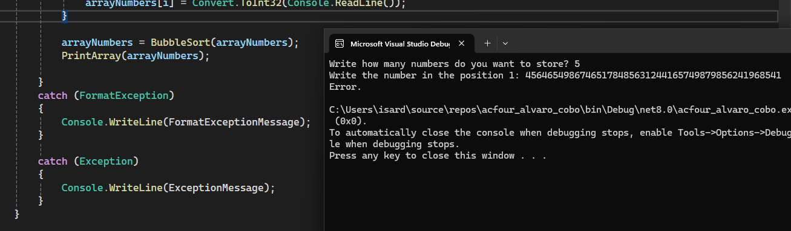

# acfour_alvaro_cobo

## Exercise 2 - Flowchart

## Exercici 6 - Casos de prova

### Cas 1 - Tot correcte

### Cas 2 - Nombre amb format incorrecte

### Cas 3 - Valor massa llarg

Això és pot arreglar afegint una excepció general al try/catch:

## Exercici 7 - Enllaços consultats
- [Teoría assignatura](https://sites.google.com/itb.cat/entornsprogramacioiprocesos/teoria/t1-introducci%C3%B3/2-disseny-dalgorismes/2-2-disseny/2-2-3-diagrames-de-flux)
- [Pass array as an argument C# - GeeksForGeeks](https://www.geeksforgeeks.org/passing-arrays-as-arguments-in-c-sharp/)
- [How to bubble sort in descending order? - Stack Overflox](https://stackoverflow.com/questions/51499930/how-to-bubblesort-an-array-in-descending-order)
- [Exception handling statements - Microsoft Documentation](https://learn.microsoft.com/en-us/dotnet/csharp/language-reference/statements/exception-handling-statements)